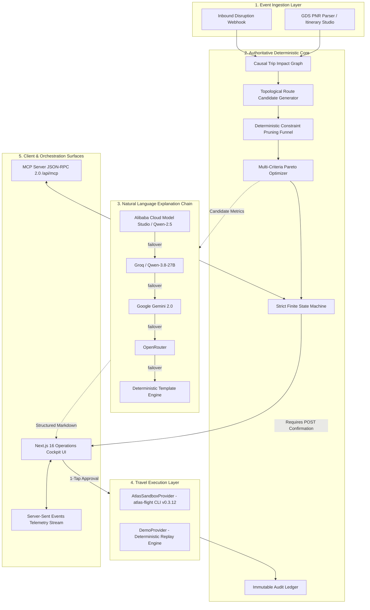

# ✈️ FlightResist AI 2.0

**Autonomous Travel Disruption Recovery Intelligence** — Built for the *Alibaba Cloud × Atlas Agentic AI Hackathon 2026*.

> When an active journey breaks, FlightResist assesses the downstream impact across the **entire multi-leg itinerary** and executes an optimal recovery plan with **single-tap human confirmation**.

[](https://nextjs.org/)
[](https://www.typescriptlang.org/)
[](https://tailwindcss.com/)
[](https://www.prisma.io/)
[](https://github.com/atlas-doc/atlas-flight-booking-skill)
[-FF6A00?logo=alibabacloud)](https://www.alibabacloud.com/en/product/model-studio)
[](#-automated-testing--verification-suite)
[](./LICENSE)

---

## 🏆 For Hackathon Judges — Start Here

| Evaluation Pillar | Weight | How FlightResist AI Delivers | Verified Evidence |
| :--- | :---: | :--- | :--- |
| **💡 Innovation** | **30%** | **Dual-Track Architecture:** Closed-form deterministic engine is 100% authoritative for safety constraints, graph risk, and multi-criteria ranking ($R = 0.35a + 0.25c + 0.20p + 0.10b + 0.10r$). The LLM is strictly explanation-only. **Causal Trip Impact Graph** evaluates the entire downstream mission (meetings, layovers, onward flights) rather than just the isolated cancelled leg. | [`src/lib/flightresist/impact-graph.ts`](./src/lib/flightresist/impact-graph.ts)<br>[`src/lib/flightresist/optimizer.ts`](./src/lib/flightresist/optimizer.ts) |
| **🛠️ Feasibility & Production Readiness** | **30%** | Real `atlas-flight` 0.3.12 CLI integration tested end-to-end against the **Atlas Sandbox** — verified real fare search, booking order creation, and mock payment resulting in a live `TICKETED` PNR. 91 safety assertions enforce strict invariants: zero unconfirmed bookings and double-click idempotency. | [`src/lib/flightresist/providers/atlas-sandbox.ts`](./src/lib/flightresist/providers/atlas-sandbox.ts)<br>[`tests/phase6-safety.mjs`](./tests/phase6-safety.mjs) |
| **☁️ Alibaba Cloud & Ecosystem** | **20%** | Multi-provider explanation fallback chain starting with **Alibaba Cloud Model Studio (Qwen-2.5)** via DashScope SDK. Real **MCP-over-HTTP server** (`/api/mcp`) exposing 5 autonomous recovery tools for agentic orchestration. Verified production deployment configurations for Alibaba Cloud ECS in `deploy/`. | [`deploy/`](./deploy)<br>[`src/app/api/mcp/route.ts`](./src/app/api/mcp/route.ts)<br>[`src/lib/flightresist/llm.ts`](./src/lib/flightresist/llm.ts) |
| **🎨 Demo, UX & Accessibility** | **20%** | Real-time Server-Sent Events (SSE) telemetry stream, interactive 5-dimension radar visualizer, live constraint sliders with sub-10ms recalculations, one-click PDF / CSV audit exports, and a high-contrast colorblind-safe Operations Cockpit. | [`src/components/flightresist/cockpit.tsx`](./src/components/flightresist/cockpit.tsx)<br>[`src/app/page.tsx`](./src/app/page.tsx) |

### ⚡ Try It in 30 Seconds (Interactive Live Flow)

1. **Launch App**: Open [`http://localhost:3000`](http://localhost:3000).
2. **Trigger Disruption (`D` key)**: Click **Simulate Disruption** or press <kbd>D</kbd> to simulate Typhoon Trami grounding flight SQ856.
3. **Inspect Causal Impact**: Watch overall trip risk surge from **0 (NORMAL)** to **87 (CRITICAL)** as the causal impact graph detects downstream meeting collapse in Tokyo.
4. **Autonomous Funnel Pruning**: The engine generates **42 route candidates** and deterministically prunes them down to **3 ranked finalists** in < 15ms.
5. **Review Plain-English Explanation**: Powered by Alibaba Cloud Model Studio (Qwen).
6. **1-Tap Approval (`A` key)**: Press <kbd>A</kbd> to execute rebooking. The state transitions to `RECOVERED` with risk dropping to **18** and an immutable audit ledger entry recorded.
7. **Reset (`R` key)**: Press <kbd>R</kbd> to test additional multi-city presets or custom PNR imports.

```
CONVENTIONAL DISRUPTION HANDLING              FLIGHTRESIST AGENTIC RECOVERY
────────────────────────────────              ───────────────────────────────
Flight cancelled → SMS alert ping             Disruption Webhook Sentinel
         ↓                                                 ↓
Traveller stands in 3-hour queue              Causal Trip Impact Graph (Risk: 87/100)
         ↓                                                 ↓
Agent rebooks arbitrary single leg            42-Candidate Topological Route Synthesis
         ↓                                                 ↓
Misses downstream connection & meeting        Deterministic Constraint Pruning (42 → 3)
         ↓                                                 ↓
$2.1M business contract lost                  Multi-Criteria Scoring + LLM Justification
                                                           ↓
                                              1-Tap Human Approval Gate
                                                           ↓
                                              Atlas Sandbox Provider Execution (2.2s)
                                                           ↓
                                              ✅ RECOVERED (Meeting Protected)
```

---

## 🧭 The Benchmark Scenario: Tokyo Deal Rescue

```
[Singapore SIN] ──(SQ856: Cancelled)──✖──> [Hong Kong HKG] ──(CX520: Misconnect)──> [Tokyo NRT]
                                  │
                                  ▼
      Autonomous Re-route: [SIN] ──(TR976)──> [Taipei TPE] ──(BR2198)──> [Tokyo NRT]
                       Arrives 22:45 JST · Next Morning 08:30 Deal Secured!
```

* **Mission**: High-stakes Tokyo M&A signing at 08:30 JST (deal value carries 58% of trip value).
* **Initial Plan**: SQ856 (SIN 08:00 → HKG 12:05) connecting to CX520 (HKG 14:30 → NRT 19:45).
* **Disruption**: Severe typhoon grounds SQ856. Conventional systems leave the traveler stranded in HKG.
* **Deterministic Pruning**:
  * 42 raw candidate permutations generated.
  * 12 pruned: Exceeded corporate budget ceiling ($1,500).
  * 18 pruned: Minimum Connection Time (MCT) violated (< 60 mins).
  * 9 pruned: Incompatible checked baggage interlining.
  * **3 Finalist Proposals** ranked by multi-objective score ($R$).
* **Recommended Plan (Option B)**: Scoot TR976 + EVA Air BR2198 via Taipei (TPE). Arrives Tokyo at 22:45 JST, safely protecting the 08:30 deal signing.

---

## 🏛️ System Architecture

FlightResist AI is designed on a **dual-track architecture** separating mathematical safety invariants from natural language synthesis.



### Safety Invariants & Scoring Model

1. **Closed-Form Multi-Criteria Optimization**:
   $$R = 0.35 \cdot S_{\text{arrival}} + 0.25 \cdot S_{\text{cost}} + 0.20 \cdot S_{\text{otp}} + 0.10 \cdot S_{\text{baggage}} + 0.10 \cdot S_{\text{comfort}}$$
2. **Prompt-Locked Explanation**: The LLM receives pre-computed numerical metrics and is prompt-locked from altering rankings, prices, or safety constraints. If all external LLM APIs timeout within 9 seconds, the deterministic template generator fires instantly without blocking user execution.
3. **Zero-Unconfirmed Booking**: State transitions to `EXECUTING` require an authenticated POST payload with an explicit proposal ID. Double submissions are rejected via atomic idempotency checks.

---

## 🧩 Real Model Context Protocol (MCP) Server

FlightResist AI 2.0 exposes a compliant **MCP-over-HTTP (JSON-RPC 2.0)** server at `/api/mcp`, allowing external AI agents (Qoder, Claude Desktop, Antigravity) to query and control the recovery lifecycle.

```bash
# Verify the live MCP endpoint
node tests/mcp-smoke.mjs http://localhost:3000
```

### Registered Tools

| Tool Name | Parameters | Purpose |
| :--- | :--- | :--- |
| `get_current_trip` | None | Returns active itinerary, graph risk score, provider status, and ledger. |
| `trigger_disruption` | `flight_number`, `event`, `reason`, `delay_minutes` | Ingests a flight disruption and starts autonomous impact analysis. |
| `get_recovery_options` | None | Returns the 42-candidate funnel, pruned summary, top 3 options, and LLM explanation. |
| `confirm_recovery` | `proposal_id` (`opt_a` \| `opt_b` \| `opt_c`) | Executes human approval gate and books the flight via Atlas Sandbox. |
| `reset_session` | None | Resets demo state to NORMAL while preserving the execution ledger. |

---

## 📡 REST API Reference

| Method | Endpoint | Description | Payload Example / Status |
| :--- | :--- | :--- | :--- |
| `GET` | `/api/trip/current` | Get active session state and itinerary | Returns `{ itinerary, state, riskScore, ledger }` |
| `POST` | `/api/disrupt/trigger` | Trigger simulated disruption event | `{"scenario": "cancellation"}` or `{"flight_number": "SQ856", "event": "DELAY", "delay_minutes": 120}` |
| `GET` | `/api/recovery/stream` | Real-time SSE agent reasoning telemetry | `text/event-stream` with heartbeat |
| `GET` | `/api/recovery/options` | Retrieve ranked recovery finalists | Returns `{ candidatesCount, prunedSummary, finalists, explanation }` |
| `POST` | `/api/recovery/confirm` | 1-Tap execution confirmation gate | `{"proposal_id": "opt_b"}` → `200 OK` (`RECOVERED`) |
| `POST` | `/api/session/reset` | Reset state to normal | `200 OK` |
| `POST` | `/api/mcp` | MCP JSON-RPC 2.0 Tool Protocol | Standard MCP tool request format |

---

## 🧪 Automated Testing & Verification Suite

The repository features a 4-tier automated test suite verifying everything from microsecond calculation SLAs to end-to-end multi-city airline rebooking.

```bash
# Run the complete 220-test automated test suite
npm test
```

### Test Results Breakdown (220/220 Passing)

```
================================================================================
  TEST EXECUTION SUMMARY
================================================================================
Tier 1: Feature Test Suites (F01–F17)                     86/86 PASS  (~80ms)
Tier 2: Boundary & Edge Case Suites (B01–B17)             85/85 PASS  (~110ms)
Tier 3: Combinatorial Pairwise Interaction Matrix         18/18 PASS  (~11ms)
Tier 4: Real-World Enterprise Workload Scenarios (S1–S9)  31/31 PASS  (~105ms)
--------------------------------------------------------------------------------
Total Tests Executed : 220 | Total Passed: 220 (100%) | Time: ~310ms
================================================================================
```

### Specialized Verification Scripts

```bash
# Run the 91-point Safety and Invariant Suite
node tests/phase6-safety.mjs http://localhost:3000

# Run the real Atlas Sandbox Golden Flow (Search -> Fare Verify -> Order -> Payment -> TICKETED)
node tests/atlas-golden-flow.mjs http://localhost:3000

# Run MCP Protocol Compliance Suite
node tests/mcp-smoke.mjs http://localhost:3000
```

---

## 🚀 Quickstart & Installation

### 1. Prerequisites

* **Node.js**: v20.x or v22.x LTS
* **npm** or **pnpm** or **bun**

### 2. Clone & Setup

```bash
git clone https://github.com/jamshidnabizada7-boop/FlightResist-AI.git
cd FlightResist-AI

# Install dependencies
npm install

# Copy environment configuration
cp .env.example .env

# Initialize database schema
npm run db:push
```

### 3. Configure LLM Backend (Optional)

In `.env`, configure any of the supported LLM providers (defaults to deterministic template fallback if unconfigured):

```env
# Alibaba Cloud Model Studio (Qwen-2.5) — Recommended for Hackathon
DASHSCOPE_API_KEY=your_dashscope_key_here

# Groq (Ultra-fast Qwen/Llama inference)
GROQ_API_KEY=your_groq_key_here

# Gemini
GEMINI_API_KEY=your_gemini_key_here
```

### 4. Run Development Server

```bash
npm run dev
```

Open [http://localhost:3000](http://localhost:3000) in your browser.

---

## 🐳 Deployment Guide

### Deploy with Docker

```bash
# Build production Docker image
docker build -t flightresist-ai .

# Run container on port 3000
docker run -d -p 3000:3000 --name flightresist flightresist-ai
```

### Deploy to Alibaba Cloud ECS

For complete production deployment behind Caddy HTTPS reverse proxy with systemd process supervision on Alibaba Cloud ECS, use the production scripts in [`deploy/`](./deploy) (`bootstrap.sh`, `Caddyfile`, and `flightresist.service`).

---

## 📁 Repository Structure

```
FlightResist-AI/
├── .agents/                      # Agent Skills (Atlas Flight Booking Skill)
│   └── skills/atlas-flight-booking/
├── deploy/                       # Production deployment configurations
│   ├── Caddyfile                 # Production Caddy TLS configuration
│   ├── Dockerfile                # Multi-stage production container build
│   ├── bootstrap.sh              # ECS automation script
│   └── flightresist.service      # Systemd service definition
├── prisma/                       # Database schema and migrations
│   └── schema.prisma             # SQLite / PostgreSQL schema
├── public/                       # Static public assets
├── src/                          # Application source code
│   ├── app/                      # Next.js App Router pages & API routes
│   │   ├── api/                  # REST & SSE & MCP endpoints
│   │   │   ├── disrupt/          # Disruption webhook trigger
│   │   │   ├── itinerary/        # Itinerary presets & imports
│   │   │   ├── mcp/              # MCP-over-HTTP JSON-RPC endpoint
│   │   │   ├── recovery/         # Options, streaming telemetry & confirm
│   │   │   └── trip/             # Current state & constraints
│   │   ├── page.tsx              # Operations Cockpit interactive page
│   │   └── layout.tsx            # Root layout & providers
│   ├── components/               # React 19 UI components
│   │   ├── flightresist/         # Cockpit, radar, funnel, studio, summary
│   │   └── ui/                   # shadcn/ui components
│   └── lib/                      # Core business logic & algorithms
│       └── flightresist/         # Deterministic engine, graph, optimizer, LLM
├── tests/                        # 220 automated tests & verification suites
│   ├── tier1-features/           # Feature tests (F01–F17)
│   ├── tier2-boundaries/         # Edge cases & boundaries (B01–B17)
│   ├── tier3-pairwise/           # Combinatorial interaction matrix
│   ├── tier4-scenarios/          # Real-world enterprise scenarios (S1–S9)
│   ├── e2e-runner.mjs            # Unified test runner
│   ├── phase6-safety.mjs         # 91-point safety assertions
│   └── atlas-golden-flow.mjs     # Atlas Sandbox end-to-end flow
├── package.json                  # Project metadata & npm scripts
├── tsconfig.json                 # TypeScript compiler configuration
└── README.md                     # Project documentation
```

---

## 📄 License

This project is licensed under the [MIT License](./LICENSE) — created by Ahmad Jamshid Nabizada for the *Alibaba Cloud × Atlas Agentic AI Hackathon 2026*.
